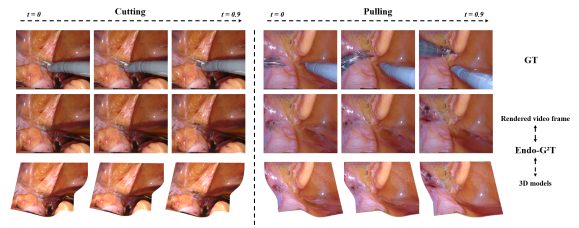
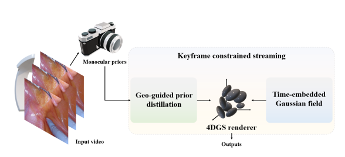

<h1 align="center">
ENDO-G2T: Geometry-Guided and Temporally Aware Time-Embedded 4D Gaussian Splatting for Endoscopic Scenes
<br>
<i><span style="color:red;">ICASSP 2026 Accept!</span></i>
</h1>
<p align="center">
  
</p>

<p align="center">
  <strong>
    <a href="https://YangleLiu.github.io/">Yangle Liu</a>,
    <a href="https://uosfz.github.io/UOSFZ/">Fengze Li</a>,
    Kan Liu,
    <a href="https://scholar.xjtlu.edu.cn/en/persons/JiemingMa/">Jieming Ma</a>
  </strong>
</p>

<p align="center">
  || <a href="https://arxiv.org/pdf/2511.21367">Paper</a>
  || <a href="https://arxiv.org/abs/2511.21367">arXiv</a> || 
</p>

This repository contains the **official implementation** of the paper:

**ENDO-G2T: Geometry-Guided and Temporally Aware Time-Embedded 4D Gaussian Splatting for Endoscopic Scenes**  

---

## 🔍 Highlights

- ✅ **Geometry-guided prior distillation** anchors early reconstruction, reducing drift in endoscopic 4DGS  
- ✅ **Time-embedded Gaussian field** ensures temporally coherent geometry with smooth motion modeling
- ✅ **Rotor-based rotation parameterization** improves stability and reduces floaters in dynamic scenes  
- ✅ **Keyframe-constrained streaming** controls point growth and maintains long-horizon efficiency  
- ✅ **State-of-the-art monocular performance** with high rendering speed on endoscopic benchmarks

---

## 🧾 Abstract

<div style="max-width: 800px; margin: auto; font-size: 0.9em;">

Endoscopic (endo) video exhibits strong view-dependent effects such as specularities, wet reffections, and occlusions. Pure photometric supervision misaligns with geometry and triggers early geometric drift, where erroneous shapes are reinforced during densiffcation and become hard to correct. We ask how to anchor geometry early for 4D Gaussian splatting (4DGS) while maintaining temporal consistency and efffciency in dynamic endoscopic scenes. Thus, we present Endo-G 2T, a geometry-guided and temporally aware training scheme for time-embedded 4DGS. First, geo-guided prior distillation converts conffdence-gated monocular depth into supervision with scale-invariant depth and depth-gradient losses, using a warm-up-to-cap schedule to inject priors softly and avoid early overfftting. Second, a time-embedded Gaussian ffeld represents dynamics in XYZT with a rotor-like rotation parameterization, yielding temporally coherent geometry with lightweight regularization that favors smooth motion and crisp opacity boundaries. Third, keyframe-constrained streaming improves efffciency and long-horizon stability through keyframe-focused optimization under a max-points budget, while non-keyframes advance with lightweight updates. Across EndoNeRF and StereoMIS-P1 datasets, EndoG 2T achieves state-of-the-art results among monocular reconstruction baselines.


</div>


## 🔗 Links

- 📄 **arXiv Paper:** [arXiv:2511.21367](https://arxiv.org/abs/2511.21367)

---

<p align="center">
  
</p>

## Overview

- Geometry-guided reconstruction
- Temporal consistency modeling
- Efficient dynamic 4DGS

---

## Cloning the Repository

The repository contains submodules, thus please check it out with 
```shell
# SSH
git clone git@github.com:Cola-1/ENDO-G2T.git --recursive
```
or
```shell
# HTTPS
git clone https://github.com/Cola-1/ENDO-G2T.git --recursive
```


---
## Datasets
In the experiments section of our paper, we utilized two datasets: the EndoNeRF dataset and StereoMIS-P1 dataset.

The  EndoNeRF dataset is accessible for download via the following link which is provided by [Yuehao Wang](https://docs.google.com/forms/d/e/1FAIpQLSfM0ukpixJkZzlK1G3QSA7CMCoOJMFFdHm5ltCV1K6GNVb3nQ/viewform).

The  StereoMIS-P1 dataset is accessible for download via the following link: [Michel Hayoz](https://zenodo.org/records/7727692)


---
## Get started

### Environment

The hardware and software requirements are the same as those of the [3D Gaussian Splatting](https://github.com/graphdeco-inria/gaussian-splatting), which this code is built upon. To setup the environment, please run the following command:

```shell
git clone https://github.com/fudan-zvg/4d-gaussian-splatting
cd DyGS
conda env create --file environment.yml
conda activate 4dgs
```

## Processing
### 1️⃣ Data Preprocessing

Prepare monocular depth priors and auxiliary data before training.

```bash
python scripts/pre_dam_dep.py \
  --dataset_root data/endonerf/pulling_soft_tissues \
  --rgb_paths images
```

---

### 2️⃣ Training

#### (a) Standard Training (Pulling Scene)

```bash
python train1.py \
  --config configs/endoNerf/pulling.yaml
```

#### (b) Training with Geometry Priors and Keyframe Controls

```bash
python train1.py \
  --config configs/endoNerf/pulling.yaml \
  --use_scale_depth \
  --lambda_si 0.3 \
  --lambda_depth_grad 0.03 \
  --key_every 30 \
  --key_min_gap 10 \
  --key_boost_enac 2.0 \
  --key_boost_depth 2.0 \
  --key_boost_rgb 1.0
```

#### (c) Long Training Run (7k Iterations)

```bash
python3 train1.py \
  --config configs/endoNerf/pulling.yaml \
  --iterations 7000 \
  --eval_interval 500
```

---

### 3️⃣ Resume Training

Resume training from the best checkpoint.

```bash
python3 train.py \
  --config configs/endoNerf/pulling.yaml \
  --start_checkpoint output/endonerf/pulling/chkpnt_best.pth
```

---

### 4️⃣ Rendering

#### Rendering with Best Checkpoint (Skip Training Views & Video)

```bash
python render.py \
  --config configs/endoNerf/pulling.yaml \
  --checkpoint output/endonerf/pulling/chkpnt_best.pth \
  --skip_train \
  --skip_video
```


---

### 5️⃣ Evaluation

Compute quantitative metrics (PSNR, SSIM, LPIPS).

```bash
python metrics.py -m output/endonerf/pulling

```


---
## TODO list:
- [ ] update the arxiv link
- [ ] release more preprocessed dataset and the pretrained model (coming soon)
- [ ] release the code of the eval

---

## Acknowledgement

Thanks the authors for their works: [StereoMIS](https://arxiv.org/abs/2304.08023v1), [diff-gaussian-rasterization-depth](https://github.com/leo-frank/diff-gaussian-rasterization-depth), [EndoNeRF](https://github.com/med-air/EndoNeRF), [Endo-4DGS](https://github.com/lastbasket/Endo-4DGS.git), [ST-Endo4DGS](https://ieeexplore.ieee.org/document/10980876).
## 📜 Citation

If you find this work useful, please consider citing:

```bibtex
@article{liu2025endog2t,
  title={Endo-G$^{2}$T: Geometry-Guided \& Temporally Aware Time-Embedded 4DGS For Endoscopic Scenes},
  author={Liu, Yangle and Li, Fengze and Liu, Kan and Ma, Jieming},
  journal={arXiv preprint arXiv:2511.21367},
  doi={https://doi.org/10.48550/arXiv.2511.21367},
  year={2025}
}
